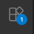
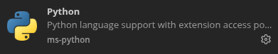
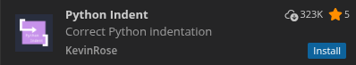
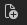
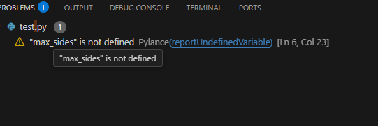
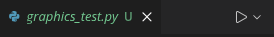

# **Installing Python on Mac or Windows**

Guide for: *MA in AI for Art and Design / MA in Human Interaction and AI, Elisava*

## Introduction

Let's make sure you've got all the tools you need for your project installed on your own machines! This will mean you can work independently, on classwork as well as your own projects, and hopefully in a way that works more smoothly than how we've been working up until now.

We're going to leave you these instructions to try to work through independently before the next class (maybe in groups - it'd be smart to get together with a couple of classmates and work through the instructions together).  If you run into problems, we'll look at them at the beginning of next week's class, or you can ask questions on Teams.

**Summary**

1. [Installing text editor](#step-1-installing-our-code-editor)
2. [Installing python](#step-2-installing-the-python-interpreter)
3. [Installing pip](#step-3-installing-pip)
4. [Setting up the editor](#step-4-set-up-vscode-for-python-development)
5. [Testing](#step-5-test-out-our-new-python-installation)

### Step 1: Installing our code editor

Firstly, we're going to need a program to edit our `python` code with. We'll use VSCode/VSCodium, which is easy to use and free. VSCode is the editor by Microsoft, while  VSCodium is an open source version without telemetry.

Both are easy to download, just choose one of your liking and go to:

- [https://code.visualstudio.com](https://code.visualstudio.com)
- [https://vscodium.com](https://vscodium.com)

Download and install.

### Step 2: Installing the `python` interpreter

This step is going to be a bit different if we're on a Mac, vs. on Windows, so follow the right instructions for your computer.

#### The `python` ecosystem

VSCode itself isn't `python` - it's just an editor, like microsoft word, or google docs, that's made especially for code files. To make our programs actually do something, we also need something called a python *interpreter*, which takes our code and runs it, which we will install now.

There are also a couple of other tools which go along with this which we're going to install, as they'll help us later in the course.

#### *On a Mac*

Download the Python installer from [https://www.python.org/downloads/](https://www.python.org/downloads/) and run it! The latest version (3.14.0 at the time of writing) is fine.

You'll be taken through the usual process for installing an application. Click through this all the way to the end, eventually the installer will close, and a finder window will open containing several things, two of which will be files called “_Install Certificates.command_” and “_Update Shell Profile.command_”.

Both of these we need to run as they do a bit of extra python setup which isn't done by the installer: making sure we can connect to the internet from python, and making sure that python's available to us when we're working in the terminal.

Double-click on each of these in turn, a terminal window will spring up, and some words will whizz by, the last of which will say “_Process completed_”. Once you see this, you can close the windows.

#### *On Windows*

We're going to use the Microsoft Store to install Python on Windows: In the search area at the bottom of the screen search for “Microsoft Store”, and open it, in the window that pops up search for “python”. In the list of results, look for “python 3.14”, and install it.

Once this is done, there's one more slightly convoluted step to make sure the rest of your system can actually find the python we just installed.

Once again, in the bar at the bottom of the screen, use the search box, this time to search for “Manage app execution aliases”. This should open a settings screen with a long list of aliases, each one of which can be switched on and off.

In this list, make sure everything that mentions python is switched to **on**, then close the window.

### Step 3: Installing `pip`

We are now going to install a program called “pip”, which helps us install extra tools and extensions to python which we can use in our programs.

`Pip` is a little tool that goes along with python, and allows us to install extra python tools and extensions we might need - this will become very useful later on in the course! For the time being, we just want to make sure pip is available for us to use, and there's a very easy way of doing this.

First, we need to open a terminal window (or “command prompt”, as it's called on Windows).

**On a Mac:** Find the “Terminal” application in the Utilities folder and double-click it, just like we did when we used it to connect to the classroom server

**On Windows:** In the search bar at the bottom, type “Command Prompt” and click the result.

In either case, you should arrive at a typical terminal prompt like the one we've been using in class.

Once you get to this prompt, type in:

```python3 -m ensurepip```

Some text will be spit out on the screen, ending with something saying something like “_Requirement satisfied_”. We can now be sure we've got pip installed and ready for when we need it, and can close the window.

### Step 4: Set up VSCode for python development

We're now ready to make sure that VSCode, can use the `python` interpreter we just installed. That way, for the rest of the course, we'll be able to work on your own laptops, exclusively in VSCode itself, which will be far simpler for all of us, and you'll be able to continue using it in future projects.

#### *Create a folder to store our code in and open it in VSCode*

1. First, click the “_files_” section in the left-hand sidebar (with this icon ), and choose “_Open folder_”.
2. In the box that pops up, you can make a new folder called “_Code_”, wherever you want to keep your `python` code and select it. It'll ask you if you want to trust this folder, just choose “yes” - it's on your own computer and only you have access to it so it's no problem.

Your “code” folder should now be open in the left-hand sidebar, and we'll add our first python file to it in a sec.

#### *Install some useful extension for working with python*

We can add all sorts of add-ons to VSCode that do all sorts of extra things, something I'm trying to avoid as much as possible at the start of this course, so that you're all working in more or less the same environment, and to avoid introducing extra complexity we don't need. However, there are two extensions that will be very useful to us that we're going to install now. First, click the “extensions” tab in the sidebar, which has an icon like this:



Then, in the sidebar, search for `python`, and find the following two extensions in the list:

- The first, helpfully, is called just `python`. Clikck install:

  

  We'll see what the `python` extension does in just a second.

- The second is called “_Python Indent_”. Click “install” next to this one as well:

  

  You might be asked to trust the “_Python indent_” extension. Again, this is fine to do.

**Why this?** The “python indent” one solves a very annoying problem with python which we will explain imminently in class (briefly, in some situations it matters A LOT how much each line of code is indented from the edge of the page, and when we get it wrong the error message we get is singularly unhelpful. Installing this extension all but stops that from happening, which is handy).

### Step 5: Test out our new python installation

Let's finish up by testing our python installation works as it should, by running a little sample program (which will also be the first program in our new “_code_” folder).

1. Click back into the files tab of the sidebar with the  icon.

2. Once you're there, you should see this icon to create a new code file (it's kinda tiny, to the top right of the left hand sidebar): 

3. Click it, and give the file a name when it shows up. Let's call it **graphics_test.py**.

4. First of all, we'd like to call your attention to the “Problems” tab at the bottom of the screen - this is one of the things the “python” extension added, and it's very useful, it alerts us to errors and possible issues in our code as we write, which means we spend less time testing. Notice also the “Terminal” tab here \- we'll be using that later on, but for now I just wanted you to be aware of where it lives:



Finally, in the main central part of the VSCODE window, paste in the following code (also availble in [code](code/graphics_test.py)):

```python
from turtle import *

speed("fastest")

max_sides = 20
width = 1000

for sides in range(3, max_sides):
    for _j in range(0, sides):
        forward(width/sides)
        right(360/sides)
    left(90)

mainloop()
```

Then, in the top right corner of the main central part of the window, hit the “run” button (which looks like the classic “play” icon: )

You should, all being well, see a new window pop up, and start drawing shapes, like this:


If that has worked, you may close the “graphics” window and close VSCode, everything is set up as it should be! If for any reason you get an error, or you don't see the graphics window, come and see one of us in the next class, or ask a question on Teams,  and we'll try and get you sorted out.
